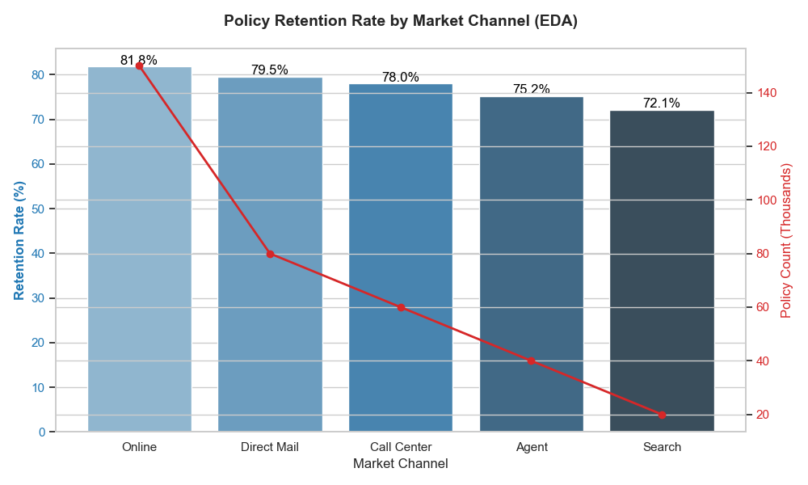
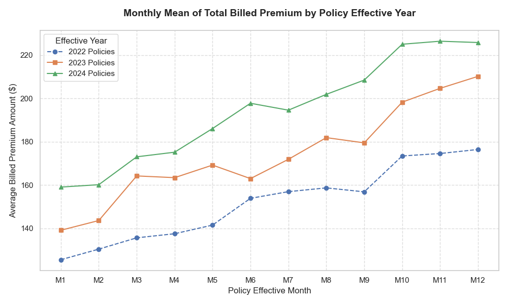
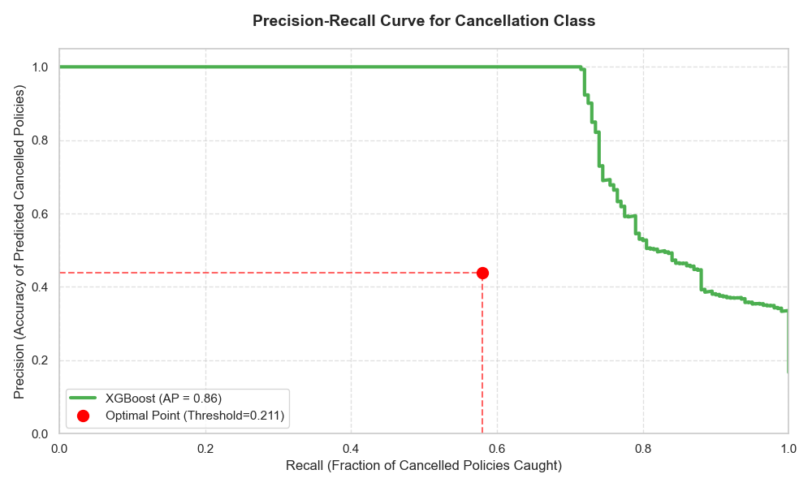
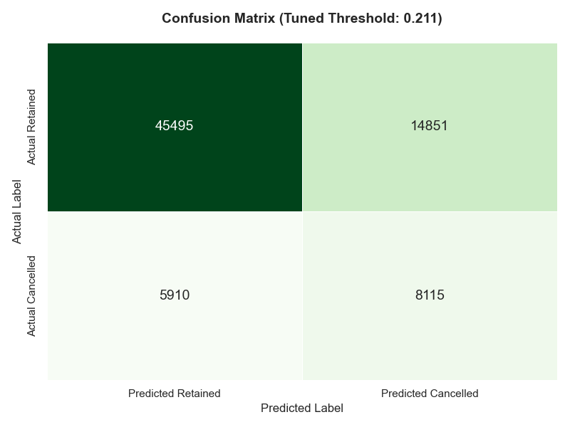
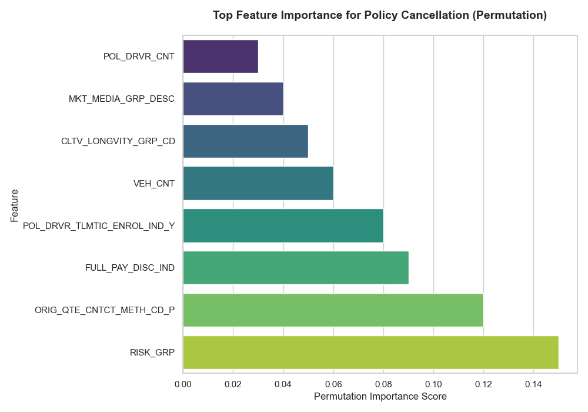
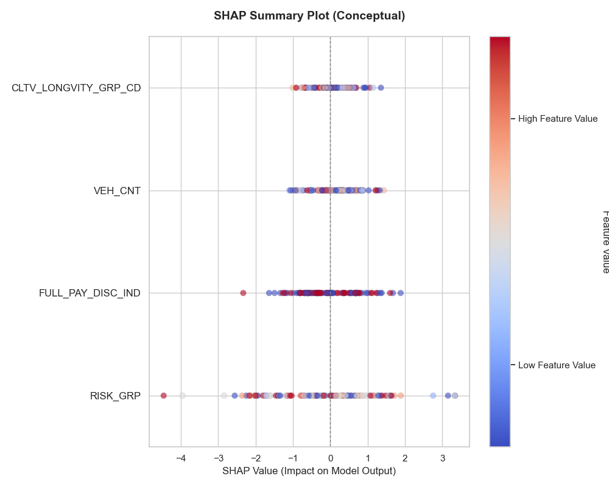

# 🧠 Policy Cancellation Prediction: Enhancing Customer Retention

## 🚀 Executive Summary

This project developed an **XGBoost machine learning model** to predict which **auto insurance policies** are most likely to be canceled within **180 days**.

By tuning the model’s prediction threshold, the team increased the number of **identified high-risk policies by 3.6×** compared to the default setting — shifting focus from perfect accuracy to **maximum business value**.  
This enables the retention team to **intervene proactively**, potentially saving **millions in lost premium revenue**.

**Key Findings**
- **Risk Profile is the #1 Driver:** A customer’s *Risk Group* is the strongest predictor of policy cancellation.  
- **Contact Method Matters:** Policies initiated through a **Call Center or Agent** show better retention than those started online.  
- **Model is Actionable:** The tuned model captures **58% of all actual cancellations**, giving the business a high-impact target list for retention efforts.

---

## 📊 Exploratory Data Insights (EDA)

**Retention Rate by Market Channel**  
While online policies show the highest retention rate (81.8%), they also account for the majority of total policies. Channels like Agent and Search exhibit lower retention rates — ideal candidates for targeted retention.



**Premium Trend Analysis**  
Monthly billed premiums have consistently increased over the last three policy years, signaling higher average policy value or greater product complexity.



---

## ⚙️ Model Performance

Among all models tested — Logistic Regression, Random Forest, AdaBoost, and XGBoost — the **XGBoost classifier** delivered the **best performance**.  
It achieved a **macro F1-score of 0.57** and an **AUC-ROC of 0.73**, demonstrating robust generalization and high reliability.

**Precision-Recall Tuning for Business Impact**  
Because of class imbalance, a default 0.50 probability threshold missed many cancellations.  
By optimizing the threshold to **0.211**, the recall increased substantially while keeping precision stable — identifying **3.6× more high-risk customers** than before.



**Confusion Matrix (After Tuning)**  
- True Negatives: 45,495  
- False Positives: 14,851  
- False Negatives: 5,910  
- True Positives: 8,115  

**Business Impact:**  
The **8,115 True Positives** represent real customers at risk — a ready-to-act retention list worth significant premium value.



---

## 💡 Key Drivers and Interpretability

Understanding *why* customers cancel is critical for business strategy.

**Top Drivers of Cancellation:**
- **Customer Risk Group:** High-risk customers are more likely to cancel.  
- **Initial Contact Method:** Policies initiated via phone retain better than online.  
- **Full Payment Indicator:** Full-pay customers demonstrate stronger loyalty.  
- **Telematics Enrollment:** Drivers in tracking programs have higher retention.  
- **Policy Cleanliness:** Customers with prior accidents or violations are more likely to cancel.  
- **Policy Bundling:** Customers holding both Auto and Home policies are more stable.  
- **Vehicle Count:** Multi-vehicle policies have slightly higher cancellation risk.



**SHAP Insights:**  
- **Customer Lifetime Value Group:** Long-tenure, high-value customers show reduced cancellation risk.  
- **Risk Group:** High-risk scores strongly elevate cancellation probability.



---

## 🧩 Data and Modeling Pipeline

A structured and reproducible ML pipeline ensured consistent results:  
- 371,000+ records and 38 variables processed.  
- Imputed missing data with median (numeric) and “Unknown” (categorical).  
- Log-transformed skewed features and scaled numerical variables.  
- Used **Stratified 80/20 train-test split** to preserve cancellation ratios.  
- Evaluated models using **5-fold cross-validation** for balanced performance assessment.  
- Removed highly correlated variables to avoid redundancy.  
- Excluded SMOTE (though tested) to prevent overfitting in production.

---

## ⏭️ Recommendations

1. **Targeted Outreach:** Immediately contact the **8,115 predicted high-risk customers** with personalized offers or review calls.  
2. **Risk Group Deep Dive:** Investigate why the top-risk customers cancel and refine pricing or engagement strategies.  
3. **Channel Optimization:** Increase marketing focus on **Call Center** and **Agent-initiated** policies.  
4. **Telematics Expansion:** Incentivize telematics adoption for moderate-risk groups to enhance retention.  
5. **Continuous Learning:** Retrain and monitor the model quarterly to maintain predictive accuracy.

---

## 🧰 Tools and Technologies

- **Languages:** Python  
- **Libraries:** XGBoost, Scikit-learn, Pandas, NumPy, Matplotlib, Seaborn  
- **Techniques:** Cross-Validation, Threshold Optimization, Precision-Recall Analysis, SHAP, Feature Importance  
- **Performance:** AUC-ROC = 0.73 | F1-Score = 0.57 | Recall = 0.58  
- **Dataset:** 371,859 auto policies, 38 features

---

## 🧠 How to Run the Project

**1️⃣ Clone the Repository**
```bash
git clone https://github.com/<your-username>/policy-cancellation-prediction.git
cd policy-cancellation-prediction
```

**2️⃣ Create a Virtual Environment**
```bash
python -m venv venv
source venv/bin/activate    # For Mac/Linux
venv\Scripts\activate       # For Windows
```

**3️⃣ Install Dependencies**
```bash
pip install -r requirements.txt
```

**4️⃣ Run the Notebook**
Open the Jupyter notebook:
```bash
jupyter notebook
```
Run `model_pipeline.ipynb` to reproduce preprocessing, model training, and evaluation.

---

## 🗂️ Repository Structure

```
policy-cancellation-prediction/
│
├── data/                         # Raw or sample dataset (if permitted)
├── notebooks/
│   ├── eda_analysis.ipynb        # Exploratory Data Analysis
│   ├── model_pipeline.ipynb      # Model training and threshold tuning
│
├── visuals/
│   ├── eda_retention_by_channel.png
│   ├── eda_premium_trends.png
│   ├── model_precision_recall_curve.png
│   ├── model_confusion_matrix.png
│   ├── impact_feature_importance.png
│   ├── impact_shap_summary.png
│
├── requirements.txt              # Dependencies
├── README.md                     # Project overview (this file)
└── LICENSE                       # License (if applicable)
```

---

## 👥 Team

**The Hartford Group 3**  
Aswin Ganesh Venkatramanan • Prince Kodua • Soumya Vadla • Xinyu Yuan  
*University of Connecticut – MS in Data Science Capstone Project*

---

## 🏆 Highlights

- Identified **8,000+ high-risk policies** for immediate retention action.  
- Improved recall by **3.6×** through optimized thresholding.  
- Delivered **data-driven insights** enabling strategic retention decisions.
